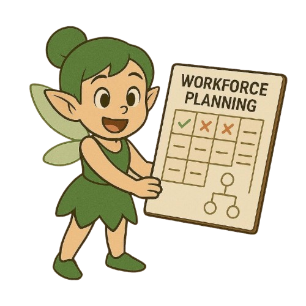
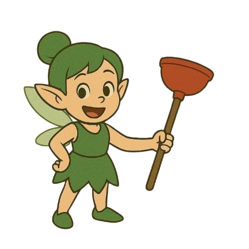

<!-- _class: lead _ -->

  <h1 class="pixelated">PixieOps</h1>
  <h2 class="subtext">Freeing Our Ops Pixies</h2>

<!-- Speaker Notes: -->
<!-- This slide sets the tone with a bold title, magical theme, and visually engaging background. -->

---

<!-- _class: default -->

### Magical workers behind the scenes

<i> however </i>

They are drowning in manual and repetitive tasks.

<!-- Speaker Notes: -->
<!-- This slide highlights the core problem - operations teams overwhelmed with manual work. -->

---

# Inefficient

# Manual

# Fragmented

# reports

---

# Workforce puzzle always changing

---

# **PixieOps**

### Multi-agent system to free our pixies

---

<!-- _class: lead -->

# **Meet Our ~~Agents~~ Pixies**

#### Workforce Planning Pixie 🗓️

#### Profitability Pixie 💰

#### Project Hygiene Pixie 🧽

---

[Link to System Diagram]()

---

# **Storyboard**

---

# **Business Value**

| Metric                   | Amount                     |
| ------------------------ | -------------------------- |
| Time reclaimed / planner | **416 h / yr**             |
| At $150 h blended rate   | **$62 k / yr**             |
| Fewer mis-allocations    | New revenue, happier staff |

---

# **Let’s lift the wand.**

## Vote **PixieOps**! 💫
